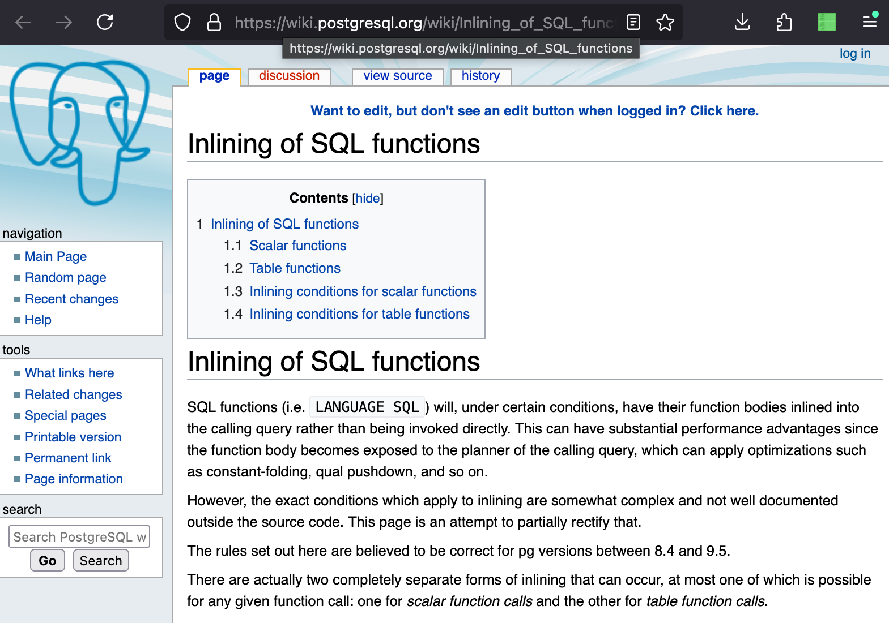

# Inlining Functions<br/>Now and Then
<!-- .element class="r-fit-text" -->

Paul A. Jungwirth

12 May 2025

Notes:

- Hi, I'm Paul Jungwirth, a freelance programmer from Portland, Oregon.
- I've been using Postgres for at least 15 years, and building extensions for most of that time.


# Lineup

- Inlining SQL Set-Returning Functions
- Inlining Non-Set-Returning SQL Functions
- Inlining Non-SQL Set-Returning Functions

Notes:

- I want to talk about how Postgres inlines functions.
- I don't mean inlined C functions, I mean the functions you call from SQL.
    - Mostly I'm talking about User-Defined Functions.
    - Postgres could inline its own built-in functions too, but getting *your* functions inlined is more interesting.
- I've got these three categories I want to cover:
    - Set-Returning Functions (SRFs as I like to call them) implemented in SQL
    - Other functions implemented in SQL
    - SRFs not implemented in SQL
- These are all interesting to a Postgres developer and an extension author.
- For extension authors, I think the last one is the most interesting.


# SRFs

```sql
CREATE OR REPLACE FUNCTION visible_sales(user_id INT)
RETURNS SETOF sales
AS $$
  SELECT * FROM sales
  WHERE vendor_id IN (SELECT company_id
                      FROM   memberships
                      WHERE  user_id = $1);
$$ LANGUAGE sql STABLE;
```

Notes:

- In case you don't know, a Set-Returning Function is a function that returns more than one result: typically more than one row.
- Let's say we have a multi-tenant e-commerce application.
  - There are users and companies and sales.
  - A user can belong to more than one company.
  - Can everyone see all the sales? No way!
  - You can only see the sales from the companies you belong to.
      - If you try to see someone else's sales, that's out of line.
  - It is convenient to wrap up this logic into a function: `visible_sales`.
  - You can think of this function as a parameterized view.
    - It returns sales records, but only the ones you can see.
    - Unlike a regular view, it accepts an input: the user id.
  - This example is based on several real customers I've worked with, btw---
    except their visibility functions were much more complicated and costly.
    - You probably have permissions logic too.
      - Wouldn't it be nice to encapsulate it?


# Inlining SQL SRFs

```console[|2-3||8-10|12]
=# EXPLAIN ANALYZE SELECT  *
FROM    visible_sales_slow(1) AS s
WHERE   vendor_id = 5000;
               QUERY PLAN
-------------------------------------------------
 Function Scan on visible_sales_slow s
   (cost=0.25..12.75 rows=5 width=56)
   (actual time=57.415..57.670 rows=2 loops=1)
   Filter: (vendor_id = 5000)
   Rows Removed by Filter: 51688
 Planning Time: 0.129 ms
 Execution Time: 57.925 ms
(5 rows)
```

Notes:

- Ideally our `visible_sales` function would compose well with the other parts of our query.
- Encapsulation shouldn't cost us performance.
- Here we're looking up user 1's visible sales, but only for a specific vendor. (here)
  - This plan (here) is not what we want.
- Postgres will call our function to find all the visible sales, then filter them. (here)
- It finds more than 50,000 rows, but it has to throw out all but two.
  - Can't we just go straight to the ones that matter?
  - Our query time was 58 milliseconds. (here)


# Inlining SQL SRFs

```console[|7|4-7|8-11]
 Nested Loop
   (cost=0.84..32.53 rows=7 width=27)
   (actual time=0.044..0.048 rows=2 loops=1)
   ->  Index Only Scan using idx_memberships_company_user on memberships
         (cost=0.42..4.44 rows=1 width=4)
         (actual time=0.025..0.026 rows=1 loops=1)
         Index Cond: ((company_id = 5000) AND (user_id = 1))
   ->  Index Scan using uq_sales_po_number on sales
       (cost=0.42..28.02 rows=7 width=27)
       (actual time=0.013..0.016 rows=2 loops=1)
         Index Cond: (vendor_id = 5000)
 Planning Time: 0.258 ms
 Execution Time: 0.071 ms
```

Notes:

- This would be a lot better. Less than a tenth of a millisecond, compared to 50+.
  - Instead of calling the function and going over all the sales,
    Postgres merges it into the rest of the query.
    - Basically the planner removed the `FuncCall` node and replaced it with a `Query` node based on the function definition.
    - You can see our plan has no more Function Scan.
    - So first of all there is no function call overhead.
    - But that's just the beginning.
      - The planner thinks we just have a subquery here, and it can apply all its tricks.
      - After unwrapping the function, it can rearrange everything into the larger query plan.
	  - Without that opaque layer, it can make much better estimates.
      - Best of it, it can push down conditions.
      - Our company filter is pushed down into the query on memberships!
      - And btw that is an index-only scan, because we only need the company id.
      - For each of those we'll find the sales with an index.
        - Postgres estimates 7 and gets 2, pretty close.

- As long as we can declare our function as `STABLE`, this is what we get.
  - `STABLE` means that our result might depend on what the tables contain, but otherwise it will give the same result for the same inputs:
    - There is no randomness or time-dependence.
    - We don't modify anything.


# Inlining SQL SRFs



Notes:

- Btw this is not very well-known, I think.
  - It's not in the Postgres docs (but I'll submit a patch).
  - There is a wiki page about it.
  - I forget how I found out about that.
  - I checked five books that were either all about Postgres performance, or at least advanced Postgres usage, and none of them mentioned it.

- So now we needn't fear performance when encapsulating logic inside functions.
- This is great news for SQL developers, and maybe extension developers too.
- But note this only works for SQL functions: not PL/pgSQL functions, not C functions, Python functions, etc.
  - Postgres has to be able to "see into" your function.
  - It has to be able to convert it into a plan tree.
  - Postgres can only do this for SQL functions, because sadly, we have not yet solved the Entscheidungsproblem.
    - Some so-called "computer scientists" claim that we never will.


# Inlining SQL SRFs

```console[|3|22-23|11-15,22-23|18-21]
=# EXPLAIN (ANALYZE) SELECT  *
FROM    visible_sales(1) AS s
WHERE   vendor_id = 2 LIMIT 10;
                   QUERY PLAN
-----------------------------------------------------
 Limit  (cost=0.42..5.84 rows=10 width=27)
        (actual time=0.972..1.010 rows=10 loops=1)
   ->  Nested Loop Semi Join
         (cost=0.42..2722.73 rows=5020 width=27)
         (actual time=0.970..1.004 rows=10 loops=1)
         ->  Seq Scan on sales
               (cost=0.00..2655.54 rows=5020 width=27)
               (actual time=0.868..0.896 rows=10 loops=1)
               Filter: (vendor_id = 2)
               Rows Removed by Filter: 134
         ->  Materialize  (cost=0.42..4.44 rows=1 width=4)
                          (actual time=0.010..0.010 rows=1 loops=10)
               ->  Index Only Scan using idx_memberships_company_user on memberships
                     (cost=0.42..4.44 rows=1 width=4)
                     (actual time=0.092..0.092 rows=1 loops=1)
                     Index Cond: ((company_id = 2) AND (user_id = 1))
 Planning Time: 0.515 ms
 Execution Time: 1.058 ms
(11 rows)
```

Notes:

- Here's another example, with two changes:
  - We're looking at a company that *does* have a lot of sales.
  - But we're paginating the results, showing only 10 per page. (here)
  - It's still fast! (here)
  - We scan all of sales, but we quit after 10 rows.  (here)
  - The permission check is just an index-only scan. (here)
  - Again, these benefits are because of function was inlined.


# `inline_set_returning_function`
<!-- .element class="r-fit-text" -->

```c[|2-4|6-8|10-14|16-19|21]
Query *inline_set_returning_function(...) {
  /* Fetch the function body */
  Datum tmp = SysCacheGetAttrNotNull(PROCOID, func_tuple, Anum_pg_proc_prosrc);
  char *src = TextDatumGetCString(tmp);

  /* Set up to handle parameters */
  SQLFunctionParseInfoPtr pinfo = prepare_sql_fn_parse_info(
    func_tuple, (Node *) fexpr, fexpr->inputcollid);

  /* Parse, analyze, and rewrite */
  List *raw_parsetree_list = pg_parse_query(src);
  List *querytree_list = pg_analyze_and_rewrite_withcb(
    linitial(raw_parsetree_list), src, ..., pinfo, NULL);
  Query *querytree = linitial(querytree_list);

  querytree = substitute_actual_srf_parameters(
    querytree,
    funcform->pronargs,
    fexpr->args);

  return querytree;
}
```

Notes:

- Here is how that works.
- The planner has this `inline_set_returning_function` function.
- Obviously the real thing is about ten times as many lines,
  but I'm calling out the essentials.
- First we look up the function definition (here).
- We build this `pinfo` struct, which will let us wire the function's parameters into the plan tree. (here)
- Then we parse that into a Query node. (here)
- Then we take the function's original parameters and inject them into the Query tree. (here)
- That's what we return. (here)


# `temporal_semijoin`
<!-- .element class="r-fit-text" -->

```sql
SELECT  a.id,
        UNNEST(multirange(a.valid_at) * j.valid_at) AS valid_at
FROM    a
JOIN (
  SELECT  b.id, range_agg(b.valid_at) AS valid_at
  FROM    b
  GROUP BY b.id
) AS j
ON a.id = j.id AND a.valid_at && j.valid_at;
```
<!-- .element style="width:100%" -->

from [https://github.com/pjungwir/temporal_ops](https://github.com/pjungwir/temporal_ops)

Notes:

- Here is a query I wish I could generalize then inline.
- It implements a semijoin between two temporal tables.
- You may know that the SQL:2011 standard introduces a bunch of new features for "temporal" tables: tables that keep a history of their subject over time.
  - But the standard doesn't give you anything for temporal outer join, semi-join, anti-join, aggregates, union, intersect, or except.
  - I've got a github repo with SQL-based implementations for those.
  - It shows you the pattern you'd use, with tests to validate them.
  - But what I really want is to wrap them up in functions, like this one.....


# `temporal_semijoin`
<!-- .element class="r-fit-text" -->

```sql
CREATE OR REPLACE FUNCTION temporal_semijoin(
  left_table text, left_id_col text, left_valid_col text,
  right_table text, right_id_col text, right_valid_col text
)
RETURNS SETOF RECORD AS $$
DECLARE
  subquery TEXT := 'j';
BEGIN
  IF left_table = 'j' OR right_table = 'j' THEN
    subquery := 'j1';
    IF left_table = 'j1' OR right_table = 'j1' THEN
      subquery := 'j2';
    END IF;
  END IF;
  RETURN QUERY EXECUTE format($j$
    SELECT  %1$I.%2$I, UNNEST(multirange(%1$I.%3$I) * %7$I.%6$I) AS %3$I
    FROM    %1$I
    JOIN (
      SELECT  %4$I.%5$I, range_agg(%4$I.%6$I) AS %6$I
      FROM    %4$I
      GROUP BY %4$I.%5$I
    ) AS %7$I
    ON %1$I.%2$I = %7$I.%5$I AND %1$I.%3$I && %7$I.%6$I;
  $j$, left_table, left_id_col, left_valid_col, right_table, right_id_col, right_valid_col, subquery);
END;
$$ STABLE LEAKPROOF PARALLEL SAFE SUPPORT temporal_semijoin_support LANGUAGE plpgsql;
```
<!-- .element style="margin-top:0px; margin-bottom:0px; font-size:0.35em" -->

Notes:
- This function is great: you give it the table and column names,
  and it builds the last query with them.
- The problem is, then your performance crashes.
- If only Postgres could build this SQL, then inline it!
- We are sooo close. Let me show you something else....


# Inlining Non-SQL

```sql[|6,8,12|7,9-11]
CREATE OR REPLACE FUNCTION commission_cents(
  _sale_id INTEGER, _salesperson_id INTEGER
)
RETURNS INTEGER
AS $$
  SELECT  s.total_price_cents *
            COALESCE(m.commission_percent, 0)
  FROM    sales AS s
  LEFT JOIN memberships AS m
  ON      m.company_id = s.vendor_id
  AND     m.user_id = _salesperson_id
  WHERE   s.id = _sale_id;
$$ LANGUAGE sql STABLE;
```

Notes:

- Now there *is* a way for functions to advertise a plan tree that is equivalent to calling the function.
- Here is an easy example.
- The function looks at sales made and computes the commission a salesperson should receive.
  - We get the sale price from the `sales` table (here), and the commission rate from the `memberships` table. (here)
- But a sale might not have a salesperson, and in that case the commission should be---declined.
  - In that case we don't really have to look up anything.
  - Postgres has a way to let us do that.


# Support Procs

```console[|13]
=# \d pg_proc
                   Table "pg_catalog.pg_proc"
     Column      |     Type     | Collation | Nullable | Default
-----------------+--------------+-----------+----------+---------
 oid             | oid          |           | not null |
 proname         | name         |           | not null |
 pronamespace    | oid          |           | not null |
 proowner        | oid          |           | not null |
 prolang         | oid          |           | not null |
 procost         | real         |           | not null |
 prorows         | real         |           | not null |
 provariadic     | oid          |           | not null |
 prosupport      | regproc      |           | not null |
 prokind         | "char"       |           | not null |
 prosecdef       | boolean      |           | not null |
 proleakproof    | boolean      |           | not null |
 proisstrict     | boolean      |           | not null |
 proretset       | boolean      |           | not null |
 provolatile     | "char"       |           | not null |
 proparallel     | "char"       |           | not null |
 pronargs        | smallint     |           | not null |
 pronargdefaults | smallint     |           | not null |
 prorettype      | oid          |           | not null |
 proargtypes     | oidvector    |           | not null |
 proallargtypes  | oid[]        |           |          |
 proargmodes     | "char"[]     |           |          |
 proargnames     | text[]       | C         |          |
 proargdefaults  | pg_node_tree | C         |          |
 protrftypes     | oid[]        |           |          |
 prosrc          | text         | C         | not null |
 probin          | text         | C         |          |
 prosqlbody      | pg_node_tree | C         |          |
 proconfig       | text[]       | C         |          |
 proacl          | aclitem[]    |           |          |
```

Notes:

- Here is `pg_proc`, from the catalog, line by line.
- Every function can carry around a helper function, called a "support function". (here)
  - It's in the `prosupport` field.
- Support functions answer various questions at plan time.
    - Each kind of question is a "SupportRequest".
    - If a support function is present, it will get asked all these questions.
    - If it doesn't know how to answer a certain kind of question, it just returns NULL.
    - Otherwise the result depends on what support request you're answering.
    - That's the general interface, so if you want to write one, now you know how to toe the line.


# Support Requests

- `SupportRequestRows`
- `SupportRequestSelectivity`
- `SupportRequestCost`
- `SupportRequestIndexCondition`
- `SupportRequestWFuncMonotonic`
- `SupportRequestOptimizeWindowClause`
- `SupportRequestModifyInPlace`
- `SupportRequestSimplify`

Notes:

- To date there are eight support requests. Here they are.
    - The first few help the planner make decisions:
        - How many rows will you return?
            - By default the planner assumes a SRF returns 1000 rows.
                - You can override that with a static value when you define the function, but a support function lets it choose case-by-case, when you plan each query.
                    - I had a patch accepted to v17 about this, for Postgres's `unnest` function.
                        - It already had a support function, and if you gave it a constant array, it would use the array's length to predict the number of rows.
                        - My patch let it use column statistics as well, if you passed it a column.
                        - So that's just an example of what you can do.
        - What is your selectivity?
        - What is your cost?
    - Then there are some fancy ones:
        - What is an index condition to pre-filter rows going into this function? I think PostGIS uses this a lot.
        - I feel like you could write some date functions that take advantage of this.
            - It's easy to accidentally write date conditions that don't use indexes.
        - There are a couple to help window functions.
        - There is one to modify composite values in-place, like arrays or json.
            - If you have a fancy custom type, this might help you.
    - Then the fanciest of all is `SupportRequestSimplify`.
        - This lets a function replace itself with a plan tree.
        - In the docs this is used for mathematical identities, like "anything plus zero" should just be anything.


# Inlining Non-SQL

```sql
SELECT  total_price_cents,
        commission_cents(id, $1)
FROM    sales
WHERE   salesperson_id IS NOT DISTINCT FROM $1
AND     sold_at BETWEEN start_of_month($2)
                    AND end_of_month($2)
```

Notes:

- Here is an example kind of like that.
- Suppose we are computing the monthly commission for each salesperson, to write each one a check.
- This query gives us a report for any month and any salesperson.
- But we also want to know the sales with *no* salesperson.
  - This function can do that too: just set parameter 1 to null.
- In that case the commission should be zero.
- But maybe there are a lot of those sales.
    - Do we really want to call the function over & over just to get zero every time?
    - We know at *plan time* that we're always passing NULL.
- It might be worth it to give this function a support proc that can handle `SupportRequestSimplify`.


# `commission_cents_support`
<!-- .element class="r-fit-text" -->

```sql[|13]
CREATE OR REPLACE FUNCTION commission_cents(
  _sale_id INTEGER, _salesperson_id INTEGER
)
RETURNS INTEGER
AS $$
  SELECT  total_price_cents * COALESCE(commission_percent, 0)
  FROM    sales AS s
  LEFT JOIN memberships AS m
  ON      m.company_id = s.vendor_id
  AND     m.user_id = _salesperson_id
  WHERE   s.id = _sale_id;
$$ LANGUAGE sql STABLE
SUPPORT commission_cents_support;
```

Notes:

- Here is the same function, but with a new last line.
  - We're declaring a support function.


# `commission_cents_support`
<!-- .element class="r-fit-text" -->

```sql
CREATE OR REPLACE FUNCTION commission_cents_support(INTERNAL)
RETURNS INTERNAL
AS 'commission_cents', 'commission_cents_support'
LANGUAGE C;
```

Notes:

- Here is the declaration for that function.
- Of course all the details are in C.
- It takes `INTERNAL` and returns `INTERNAL`.


# `commission_cents_support`
<!-- .element class="r-fit-text" -->

```c[|2|2-6|8-10]
Datum commission_cents_support(PG_FUNCTION_ARGS) {
  Node *rawreq = (Node *) PG_GETARG_POINTER(0);
  SupportRequestSimplify *req;

  if (!IsA(req, SupportRequestSimplify)) {
    PG_RETURN_POINTER(NULL);

  req = (SupportRequestSimplify *) rawreq;

  FuncExpr *expr = req->fcall;

  ...
```

Notes:

- Here is roughly the C code for this.
- You can find the complete code in the github repo for these slides.
- The first argument is always the support request struct, which is a Node. (here)
  - Each support request has its own node type.
  - We have to make sure the one is get is a support request we can handle. (here)
  - It gives us the parse tree for this function call, so we grab that. (here)


# `commission_cents_support`
<!-- .element class="r-fit-text" -->

```c
typedef struct SupportRequestSimplify
{   
    NodeTag     type;
    
    struct PlannerInfo *root;
    FuncExpr   *fcall;
} SupportRequestSimplify;
```

Notes:

- Here is the `SupportRequestSimplify` struct btw.
- We have to use what's here to see if we can rewrite the function.
- We have the function call, including its arguments,
- and we have a PlannerInfo, which gives us some context if we need it.


# `commission_cents_support`
<!-- .element class="r-fit-text" -->

```c[|1|1-4|1-15|17]
Node *node = lsecond(expr->args);
if (IsA(node, Const)) {
  Const *c = (Const *) node;
  if (c->constisnull) {
    Const *ret = makeConst(
      INT4OID,          /* type */
      -1,               /* typmod */
      0,                /* collid */
      4,                /* len */
      Int32GetDatum(0), /* value */
      false,            /* isnull */
      true              /* byval */
    );
    PG_RETURN_POINTER(ret);
  }
}
PG_RETURN_POINTER(NULL);
```

Notes:

- Okay back to our support function....
- I'm skipping lots of error checking.
- We get the function's second argument, the salesperson id. (here)
- If it's a Const node and it's NULL, (here)
  - then our result will always be a 0. (here)
- We return a zero `Const` node.
- Postgres can replace the whole function call with that.
- Otherwise we return NULL, saying we can't make any simplifications. (here)

- Can we handle non-Const inputs?
  - Well if our function is called as part of a parameterized query, like from psycopg,
    then by the time we get here those are already `Const` nodes. So that's covered.
  - But if it was called from another wrapping function and passed parameters from that function,
    we would get `Param` nodes as our funcargs.
    - Those aren't bound yet, so we have no knowledge of what they'll be.
  - But if you can simplify other parts of the result, you can do that, and wire up the params,
    just as the SQL-language inlining was doing. (I haven't experimented with this yet.)
  - The point is, you don't have to return just a `Const`.

  - So, could you return a `Query`?
    - Does this let us inline `temporal_semijoin`?
    - Sadly no.
      - The planner simplifies SRFs in a totally different place.


# There's a Patch for That!
<!-- .element class="r-fit-text" -->

https://commitfest.postgresql.org/patch/5083/

Notes:

- Okay, but what if we patched Postgres?
- Over in that place where we inline SQL-language SRFs, let's accept a new Support Request to inline a function in any language.
- So I have a patch for this.
    - It got neglected while I was fixing bugs in temporal foreign keys, but I'm starting to pick it up again.
    - I think it just needs some refactoring.
    - Having more people check it out and give it a try would be great.
    - So why not test it yourself?---if you're so inclined.


# `SupportRequestInlineSRF`
<!-- .element class="r-fit-text" -->

```c[|1|2|3-8|9-10]
char *sql = "....";
List *parsed = pg_parse_query(sql);
List *analyzed = pg_analyze_and_rewrite_with_cb(
  linitial(parsed),
  sql,
  (ParserSetupHook) sql_fn_parser_setup,
  pinfo,
  NULL);
Query *q = linitial(analyzed);
PG_RETURN_POINTER(q);
```

Notes:

- Here you go.
    - This is what you would write as the support function author.
- Once again error checking is wildly absent.
    - I'm not even checking for `Const` inputs.
    - If you want to see the real thing, you can look at that `temporal_ops` github repo.
    - Of course the function there only works if my patch is applied.
- Somehow you build your SQL string. (here)
- Then Postgres gives us everything we need.
    - You parse it. (here)
    - You do analysis and rewriting. (here)
    - That's your result. (here)
- This is just what we saw from SQL-only inlining.


# Caveats

Notes:

- Support functions have to be written in C.
    - This makes it hard for users to access, since so many people these days are in the Cloud.
    - You could have some kind of C shim that dispatches to a user-supplied plpgsql function.
        - This would allay Cloud vendors' exploit fears, but not necessarily all the security fears of the database owner.


# Generalizing

```sql[|15-27]
CREATE OR REPLACE FUNCTION temporal_semijoin(
  left_table text, left_id_col text, left_valid_col text,
  right_table text, right_id_col text, right_valid_col text
)
RETURNS SETOF RECORD AS $$
DECLARE
  subquery TEXT := 'j';
BEGIN
  IF left_table = 'j' OR right_table = 'j' THEN
    subquery := 'j1';
    IF left_table = 'j1' OR right_table = 'j1' THEN
      subquery := 'j2';
    END IF;
  END IF;
  RETURN QUERY EXECUTE format($qqq$
    SELECT  %1$I.%2$I, UNNEST(multirange(%1$I.%3$I) * %7$I.%6$I) AS %3$I
    FROM    %1$I
    JOIN (
      SELECT  %4$I.%5$I, range_agg(%4$I.%6$I) AS %6$I
      FROM    %4$I
      GROUP BY %4$I.%5$I
    ) AS %7$I
    ON %1$I.%2$I = %7$I.%5$I AND %1$I.%3$I && %7$I.%6$I;
  $qqq$,
  left_table, left_id_col, left_valid_col,
  right_table, right_id_col, right_valid_col,
  subquery);
END;
$$ STABLE LEAKPROOF PARALLEL SAFE SUPPORT temporal_semijoin_support LANGUAGE plpgsql;
```
<!-- .element style="margin-top:0px; margin-bottom:0px; font-size:0.35em" -->

Notes:

- And maybe we can push things further.
- Go back to my `temporal_semijoin` function.
- We end with a `RETURN QUERY EXECUTE`
    - This has got to be a really common pattern.
    - Could plpgsql notice that your function does that, and that it's `STABLE`, and automatically attach a support function that:
        - Checks for all-`Const` arguments,
        - Runs the plpgsql up 'til the `RETURN QUERY EXECUTE`,
        - Uses the string input to build a query tree but not run it?
        - I think this might be feasible.
    - To really dream, what if we *did* accept non-`Const` parameters, as long as they just got passed through as parameters to the `EXECUTE`, and we plumbed those all the way back to their source when we inlined the query? SQL-language inlining does this already.

  - Or here is something maybe more realistic.
    - If my patch gets in I think you could do this with an extension---maybe eventually put it core.
    - The extension defines a general-purpose support function that you can attach to your functions.
      - It dispatches to your own user-defined function, written in plpgsql or whatever, passing a json version of the `FuncCall` node.
      - Your plpgsql function returns a string with the SQL it should use.
      - Then the extension function parses the SQL, just like the existing core-Postgres SQL-function inlining code.
      - So we've got a Query node, and that gets inlined.
      - We could even support parameters: they get turned into Param nodes.
        - Again this is just like what we have already for SQL-only functions.

- Anyway, I'm excited to see what people do with this, if it gets into core.
  - It's the most exciting kind of feature: that kind that lets people do things we haven't thought of yet.
  - Postgres lore is that we started out in Lisp, and our C is still kind of Lispy.
  - So what if we gave our users macros?


# Bibliography

- https://github.com/pjungwir/inlining-postgres-functions
- https://wiki.postgresql.org/wiki/Inlining_of_SQL_functions
- https://commitfest.postgresql.org/patch/5083/
- https://github.com/pjungwir/temporal_ops

Notes:

- Here are some references.


# Thank you!

https://github.com/pjungwir/inlining-postgres-functions

Notes:

- Thanks for coming! Here is the github for this talk.
- I'm happy for questions, feedback, and flames.
- Sharing this with you has been . . . sublime.
